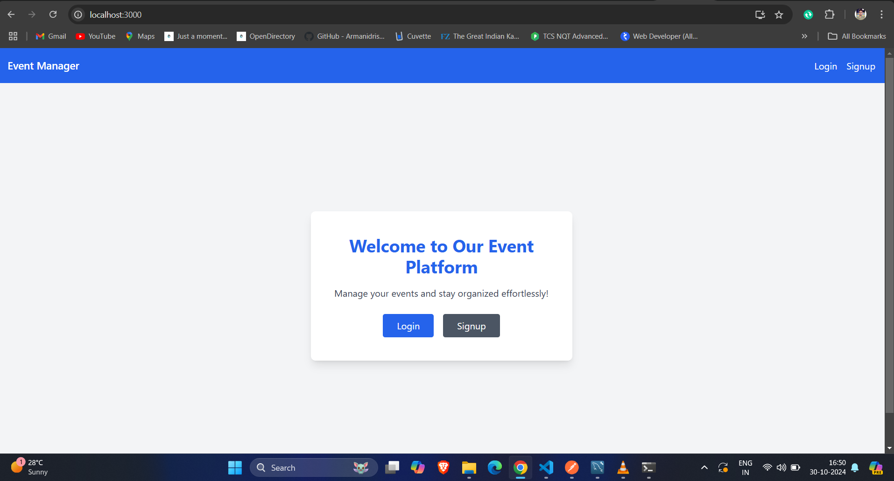
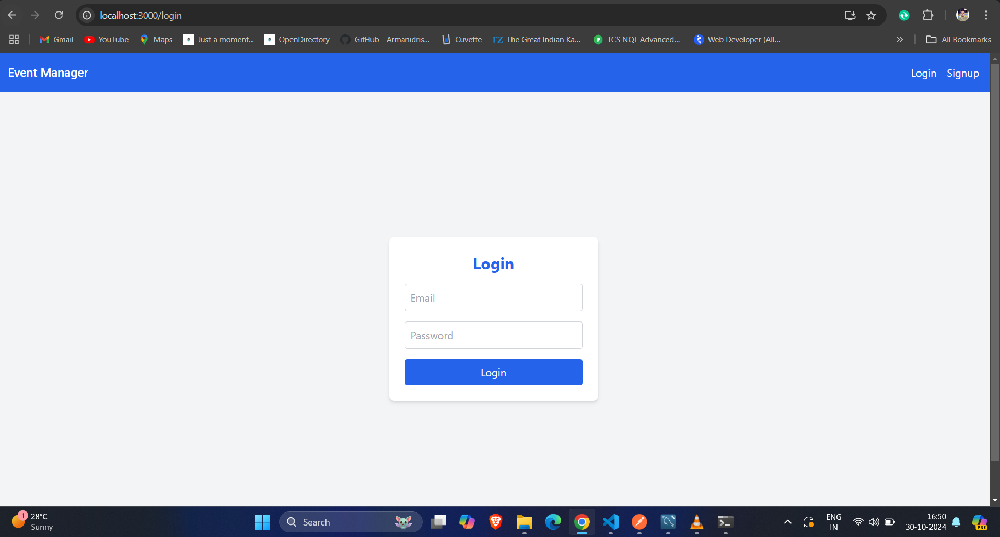
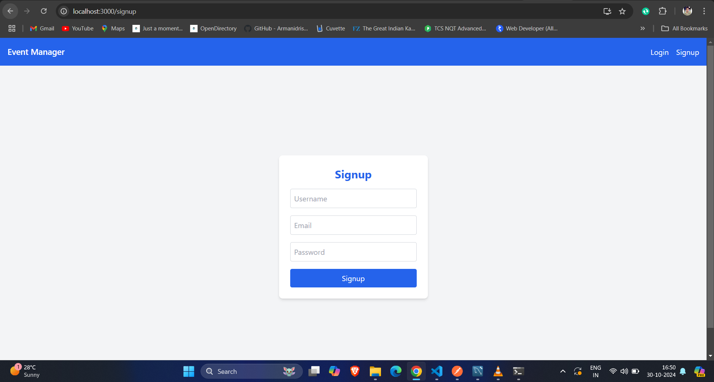
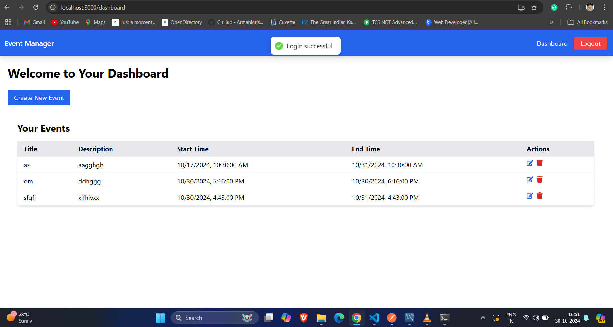
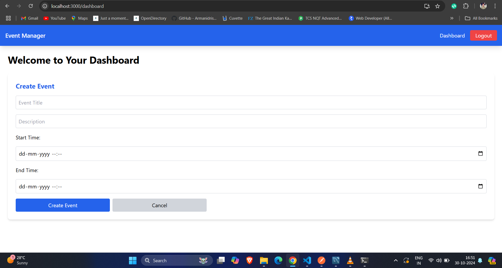
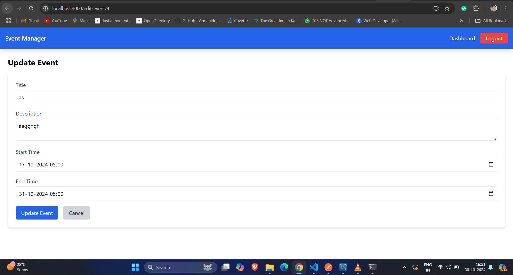

# Event Manager

Event Manager is a web-based application designed to facilitate event management, including creating, editing, and deleting events. It offers both frontend and backend functionality, ensuring a complete solution for managing events seamlessly.

# Deployed Link 

[Event-Manager](https://event-front-ckgv.onrender.com/)

## Project Screenshot








## Features
- Create, edit, and delete events
- View event details
- Backend API for event management

## Installation

### Prerequisites
- Node.js
- npm or yarn

### Setup
1. Clone the repository:
   ```bash
   git clone https://github.com/OmkeshwarGupta/Event-Manager.git
   cd Event-Manager
2. Install dependencies for both frontend and backend:
   ```bash
    cd frontend
    npm install
    cd ../backend
    npm install

3. Start the backend server:
    ```bash
    npm run dev
4.Start the frontend:
  ```bash
    npm start


